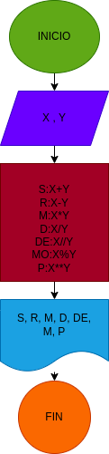

# OperacionesAritmeticas ejercicio N.3
## programa para calcular la suma, resta, multiplicación, división, división entera, modulo y potencia

# ANALISIS

variable de entrada(input)

X:primer numero

Y:segundo numero

variables de proceso y salida(processing, storage, output)

S: suma de X y Y

R: resta de X y Y

M: multiplicacion de X y Y

D: division de X y Y

DE: division entera de X y Y

MO: modulo de X y Y

P: potencia de X y Y

# DISEÑO

# CONSTRUCCION
